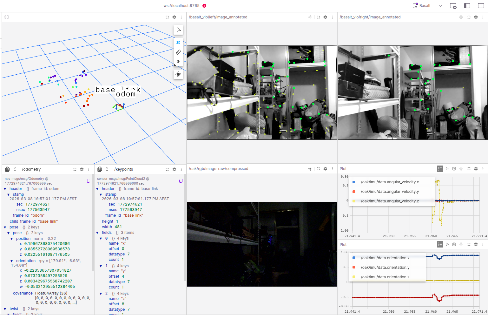

# BASALT ROS

A ROS2 Jazzy build designed to work with Luxonis depthai-ros and the OAK-FFC-3P camera module.



## TO DO

- Add doxygen comments to libraries
- All files, classes, and public functions must include Doxygen documentation for clear parameter and function definitions.
  - Use `@brief` for one-line summaries
  - Document all parameters with `@param[in/out]`
  - Include `@return` for non-void functions
  - Add `@pre` tags matching code assertions (NASA principle compliance)
  - Example:

    ```cpp
    /**
     * @brief Brief description of the class/function.
     *
     * Detailed description providing more context, usage examples,
     * and any important considerations.
     *
     * @param parameter_name Description of the parameter.
     * @return Description of the return value.
     */
    class MyClass {
        // ...
    };
    ```

- Add reliability metric / odom freeze detection
- Methods for handling poor keyframes environment
- Calibration only works with pinhole-radtan8 model. Implementation and testing needs to be done for other models.
- Update calibration to export calibration file as yaml instead of json
- Remove unused scripts and libraries from basalt and basalt-ros libraries that are not used in ros2 implementation
- 3D point cloud is visualised in foxglove. Remove Basalt GUI testing environment as not used.

---

## Build

Source ROS2 before any build:

```bash
source /opt/ros/jazzy/setup.bash
```

### VIO node (standard build)

Builds the visual odometry node and all ROS2 components. Calibration tools and Pangolin GUI are excluded by default for faster builds.

```bash
cd /media/logic/USamsung/ros2_ws
colcon build --packages-select basalt_ros2 --parallel-workers 8
```

### With calibration tools

Includes `basalt_calibrate` and `basalt_calibrate_imu` (requires Pangolin — significantly longer compile):

```bash
cd /media/logic/USamsung/ros2_ws
colcon build --packages-select basalt_ros2 --parallel-workers 8 \
  --cmake-args -DBASALT_BUILD_CALIBRATION_TOOLS=ON
```

### depthai-ros driver

Required for OAK-FFC-3P camera. Build separately if camera driver changes are needed:

```bash
cd /media/logic/USamsung/ros2_ws
CMAKE_PREFIX_PATH="/usr/local:$CMAKE_PREFIX_PATH" \
colcon build --packages-select depthai_ros_driver --parallel-workers 8
```

### Clean rebuild

If you see cmake install errors (e.g. missing `.a` files from stale build cache):

```bash
rm -rf /media/logic/USamsung/ros2_ws/build/basalt_ros2 \
       /media/logic/USamsung/ros2_ws/install/basalt_ros2
cd /media/logic/USamsung/ros2_ws
colcon build --packages-select basalt_ros2 --parallel-workers 8
```

---

## Camera Calibration

Calibration must be done before running the VIO node. The calibration tools are built as part of the normal colcon build and are located in the build directory.

### Prerequisites

Set `$DEV_HOME` in your `~/.bashrc` to your workspace root (the parent of `basalt_calibration/`):

```bash
export DEV_HOME="/media/logic/USamsung"  # adjust per system
```

### Build Output Location

After building with colcon, the calibration executables are at:

```text
<ros2_ws>/build/basalt_ros2/basalt_calibrate
<ros2_ws>/build/basalt_ros2/basalt_calibrate_imu
```

Run them from that directory:

```bash
cd /media/logic/USamsung/ros2_ws/build/basalt_ros2
source /opt/ros/jazzy/setup.bash
```

### AprilGrid Configuration

Create the AprilGrid configuration file (measure your own grid):

```bash
cat > $DEV_HOME/basalt_calibration/aprilgrid.json << 'EOF'
{
    "tagCols": 6,
    "tagRows": 6,
    "tagSize": 0.0882,
    "tagSpacing": 0.303
}
EOF
```

`tagSpacing` is a **ratio** (gap / tagSize), not an absolute measurement. A 1% error in measurements causes ~1–2 px reprojection error.

### Calibration Overview

```text
Recording 1: Stereo + IMU (30 fps, stereo-only driver)
  ├── Step 1: Stereo camera calibration  → stereo_imu_calibration_results/calibration.json
  └── Step 2: IMU calibration            → stereo_imu_calibration_results/calibration.json (updated)

Recording 2: RGB + Stereo + IMU (~4.5 fps, 3-camera sync driver)  [optional]
  └── Step 3: 3-camera calibration       → stereo_rgb_imu_calibration_results/calibration.json

Step 4: Merge stereo+IMU with RGB extrinsics → merged_calibration_results/calibration.json  [optional]

Final: Copy result to config/calibration.json
```

**IMPORTANT:** The `--result-path` for Steps 1 and 2 **must be identical**. The number of cameras in `calibration.json` must match the recording — using a 3-camera file with a 2-camera recording causes silent failures.

### Step 1: Stereo Camera Calibration

Mount the **AprilGrid on a wall** and **move the camera rig** dynamically in front of it. Use Recording 1 (stereo + IMU, 30 fps).

```bash
./basalt_calibrate \
  --dataset-path  $DEV_HOME/basalt_calibration/stereo_imu_calibration_record/stereo_imu_calibration_record_0.mcap \
  --dataset-type mcap \
  --aprilgrid  $DEV_HOME/basalt_calibration/aprilgrid.json \
  --result-path $DEV_HOME/basalt_calibration/stereo_imu_calibration_results \
  --cam-types pinhole-radtan8 pinhole-radtan8
```

**In the GUI:**

1. Wait for corner detection to complete
2. Click **"init_cam_intr"** → **"init_cam_poses"** → **"init_cam_extr"** → **"init_opt"**
3. Check **"opt_until_converge"** — wait for convergence
4. Click **"save_calib"**

Good calibration: mean reprojection error < 1.0 px (ideal < 0.5 px).

### Step 2: IMU Calibration

Use the **same Recording 1** and the **same `--result-path`** as Step 1. The stereo `calibration.json` is loaded automatically.

**IMU noise parameters** (Kalibr continuous-time model):

| IMU | `--gyro-noise-std` | `--accel-noise-std` | `--gyro-bias-std` | `--accel-bias-std` |
| --- | --- | --- | --- | --- |
| BMI270 (OAK-FFC-3P) | 0.0005 | 0.02 | 0.0001 | 0.001 |
| BMI160 (TUM-VI/EuRoC) | 0.000282 | 0.016 | 0.0001 | 0.001 |

Warning: Do not set `gyro-noise-std` above 0.002 — it de-weights gyroscope measurements and prevents the optimizer from constraining rotation.

```bash
./basalt_calibrate_imu \
  --dataset-path $DEV_HOME/basalt_calibration/stereo_imu_calibration_record/stereo_imu_calibration_record_0.mcap \
  --dataset-type mcap \
  --aprilgrid $DEV_HOME/basalt_calibration/aprilgrid.json \
  --result-path $DEV_HOME/basalt_calibration/stereo_imu_calibration_results \
  --gyro-noise-std 0.0005 \
  --accel-noise-std 0.02 \
  --gyro-bias-std 0.0001 \
  --accel-bias-std 0.001
```

**In the GUI (buttons left to right):**

1. **"load_dataset"** → **"detect_corners"** → **"init_cam_poses"** → **"init_cam_imu"** → **"init_opt"**
2. Check **"opt_until_converge"** — wait for convergence
3. Optionally enable `opt_cam_time_offset` and `opt_imu_scale` for refinement
4. Click **"save_calib"** — updates `calibration.json` with IMU extrinsics

**Evaluate:**
- g vector norm should be close to 9.81 m/s²
- Mean reprojection error < 2 px (ideal < 1 px)
- Spline plots (solid) should follow raw IMU data (dashed)

### Step 3: 3-Camera Calibration (Optional — RGB Extrinsics)

Only needed if using the RGB camera. Use Recording 2 (~4.5 fps, all 3 cameras). Mount camera on tripod, **move the AprilGrid board** in front of the cameras.

```bash
./basalt_calibrate \
  --dataset-path $DEV_HOME/basalt_calibration/stereo_rgb_imu_calibration_record/stereo_rgb_imu_calibration_record_0.mcap \
  --dataset-type mcap \
  --aprilgrid $DEV_HOME/basalt_calibration/aprilgrid.json \
  --result-path $DEV_HOME/basalt_calibration/stereo_rgb_imu_calibration_results \
  --cam-types pinhole-radtan8 ds pinhole-radtan8
```

Use `ds` (double sphere) for the IMX577 RGB (113° HFOV). Same GUI workflow as Step 1.

### Step 4: Merge Calibrations (Optional — RGB Only)

Combines stereo+IMU (Step 2) with RGB extrinsics (Step 3):

```bash
python3 /media/logic/USamsung/ros2_ws/src/basalt_ros2/scripts/merge_calibrations.py \
  --stereo-imu $DEV_HOME/basalt_calibration/stereo_imu_calibration_results/calibration.json \
  --three-cam $DEV_HOME/basalt_calibration/stereo_rgb_imu_calibration_results/calibration.json \
  --output $DEV_HOME/basalt_calibration/merged_calibration_results/calibration.json
```

For VIO (stereo + IMU only), skip Steps 3–4 and use the 2-camera result directly.

### Copy Result to Config

```bash
cp $DEV_HOME/basalt_calibration/stereo_imu_calibration_results/calibration.json \
   /media/logic/USamsung/ros2_ws/src/basalt_ros2/config/calibration.json
```

---

## Testing instructions

```bash
# 1. Terminal 1 — Camera driver
source /opt/ros/jazzy/setup.bash && source install/setup.bash
ros2 launch depthai_ros_driver driver.launch.py \
  params_file:=/media/logic/USamsung/ros2_ws/src/depthai-ros/depthai_ros_driver/config/oak_ffc_3p_stereo_vio.yaml \
  camera_model:=OAK-FFC-3P
```

```bash
# 2. Terminal 2 — VIO node with image annotation and config file enabled
source /opt/ros/jazzy/setup.bash && source install/setup.bash
ros2 run basalt_ros2 visual_odometry_node \
  --ros-args \
  -p calib_path:=/media/logic/USamsung/ros2_ws/src/basalt_ros2/config/calibration.yaml \
  -p config_path:=/media/logic/USamsung/ros2_ws/src/basalt_ros2/config/ros1_vio_config.yaml \
  -p imu_topic:=/oak/imu/data \
  -p left_image_topic:=/oak/left/image_raw \
  -p right_image_topic:=/oak/right/image_raw \
  -p publish_cloud:=true \
  -p publish_images:=true
```

```bash
# 3. Terminal 3 — Verify topics exist
source /opt/ros/jazzy/setup.bash && source install/setup.bash
ros2 topic list | grep basalt_vio
```


## Configuration

The VIO node is tuned via a JSON config file passed at launch. Two pre-tuned configs are provided in `config/`:

| File | Use when |
|---|---|
| `config/vio_config.json` | Running with IMU (default mode with OAK-FFC-3P + BMI270) |
| `config/vo_config.json` | Running without IMU (visual odometry only, `imu_topic` empty) |

### Applying a config file

Pass the `config_path` parameter at launch:

```bash
source /opt/ros/jazzy/setup.bash && source install/setup.bash
ros2 run basalt_ros2 visual_odometry_node \
  --ros-args \
  -p calib_path:=/media/logic/USamsung/ros2_ws/src/basalt_ros2/config/calibration.yaml \
  -p config_path:=/media/logic/USamsung/ros2_ws/src/basalt_ros2/config/ros1_vio_config.yaml \
  -p imu_topic:=/oak/imu/data \
  -p left_image_topic:=/oak/left/image_raw \
  -p right_image_topic:=/oak/right/image_raw \
  -p publish_cloud:=true \
  -p publish_images:=true
```

If `config_path` is omitted, built-in defaults are used silently.

---

## Config Parameter Reference

### Optical Flow Parameters

These control the Lucas-Kanade patch tracker that finds and tracks image features between frames.

| Parameter | Type | VIO default | VO default | Effect |
|---|---|---|---|---|
| `optical_flow_type` | string | `frame_to_frame` | `frame_to_frame` | Tracker variant: `frame_to_frame` tracks patches against the previous frame |
| `optical_flow_detection_grid_size` | int | 50 | 40 | Size (px) of each detection cell. Smaller = denser features. At 640×400: grid 50 → ~96 cells, grid 40 → ~160 cells |
| `optical_flow_max_recovered_dist2` | float | 0.04 | 0.04 | Forward-backward consistency check threshold. Smaller = stricter. 0.04 rejects if error > 0.2 px |
| `optical_flow_pattern` | int | 51 | 51 | Sampling pattern for tracked patch. 51 = 52-point diamond at 0.5× scale (±3.5 px radius) |
| `optical_flow_max_iterations` | int | 5 | 5 | Max Lucas-Kanade iterations per pyramid level. More = more precise, more CPU |
| `optical_flow_levels` | int | 3 | 3 | Image pyramid depth. More levels handle faster motion. Increase to 4 if tracking drops on fast rotation |
| `optical_flow_epipolar_error` | float | 0.005 | 0.005 | Epipolar constraint threshold for stereo matching. Raise to 0.01 if calibration is imperfect |
| `optical_flow_skip_frames` | int | 1 | 1 | Send every N-th result to VIO. 1 = all frames, 2 = every other. Use 2 to halve CPU load |

### Sliding Window and Keyframe Parameters

These control when new keyframes are created and how many states are kept in the optimizer.

| Parameter | Type | VIO default | VO default | Effect |
|---|---|---|---|---|
| `vio_max_states` | int | 3 | 3 | Max IMU states in active window. Larger = more pre-integration history, more compute |
| `vio_max_kfs` | int | 7 | 7 | Max keyframes retained. Reduce to 5 on embedded, raise to 10 for more map coverage |
| `vio_min_frames_after_kf` | int | 5 | 1 | Minimum frames between new keyframes. VIO conservative (5), VO aggressive (1) |
| `vio_new_kf_keypoints_thresh` | float | 0.7 | 0.8 | Fraction of features already in 3D map. Lower = fewer KFs. Raise to 0.8 for fast motion |
| `vio_kf_marg_feature_ratio` | float | 0.1 | 0.2 | KF is removable when <this fraction of its features tracked. Lower = keep KFs longer |
| `vio_marg_lost_landmarks` | bool | true | true | Remove invisible landmarks before marginalization. Keeps map lean |

### Optimization Parameters

These control the non-linear bundle adjustment solver that refines poses and landmarks.

| Parameter | Type | Default | Effect |
|---|---|---|---|
| `vio_linearization_type` | string | `ABS_QR` | Solver method. ABS_QR = QR (most stable, recommended). ABS_SC = Schur. REL_SC = relative Schur |
| `vio_sqrt_marg` | bool | true | Store marginalization prior in QR form. Improves numerical stability. Keep true with ABS_QR |
| `vio_max_iterations` | int | 7 | Max Levenberg-Marquardt iterations per frame. More = better convergence, higher latency |
| `vio_obs_std_dev` | float | 0.5 | Observation noise std-dev (pixels). Raise to 1.0 if vision residuals large (poor calibration) |
| `vio_obs_huber_thresh` | float | 1.0 | Huber loss threshold. Lower (0.5) = more aggressive outlier rejection |
| `vio_min_triangulation_dist` | float | 0.05 | Minimum baseline (meters) for landmark triangulation. Reduce to 0.02 for close-range platforms |
| `vio_enforce_realtime` | bool | false | Drop frames if VIO falls behind. Enable on slow hardware where processing is slower than camera rate |

### Levenberg-Marquardt Damping

| Parameter | Type | Default | Effect |
|---|---|---|---|
| `vio_lm_lambda_initial` | float | 1e-4 | Starting damping factor. Lower = more aggressive (Newton-like) initial step |
| `vio_lm_lambda_min` | float | 1e-6 | Floor on λ. Prevents collapse to zero when LM succeeds every step |
| `vio_lm_lambda_max` | float | 1e2 | Ceiling on λ. If backtracking exceeds this, optimization fails for the frame |

### Initialization Priors

| Parameter | Type | Default | Effect |
|---|---|---|---|
| `vio_init_pose_weight` | float | 1e8 | Weight on initial position/yaw (very strong — locks first frame to origin) |
| `vio_init_ba_weight` | float | 1e1 | Weight on initial accel bias (weak — allows fast calibration) |
| `vio_init_bg_weight` | float | 1e2 | Weight on initial gyro bias |

### Tuning for Common Scenarios

#### Slow environment / close range (AUV hovering, indoor)

```json
{
  "config.optical_flow_detection_grid_size": 40,
  "config.vio_min_triangulation_dist": 0.02,
  "config.vio_new_kf_keypoints_thresh": 0.8,
  "config.vio_min_frames_after_kf": 2
}
```

Denser features and lower triangulation threshold compensate for small baseline motion.

#### Fast motion / high rotation (surface vessel, aerial)

```json
{
  "config.optical_flow_levels": 4,
  "config.optical_flow_max_iterations": 7,
  "config.vio_new_kf_keypoints_thresh": 0.8,
  "config.vio_min_frames_after_kf": 1
}
```

Extra pyramid level handles large pixel displacements. Aggressive keyframing captures rapid geometry changes.

#### CPU-constrained hardware (embedded ARM)

```json
{
  "config.optical_flow_detection_grid_size": 60,
  "config.optical_flow_skip_frames": 2,
  "config.vio_max_kfs": 5,
  "config.vio_max_iterations": 5,
  "config.vio_enforce_realtime": true
}
```

Fewer features, half-rate updates, smaller KF window, fewer optimizer iterations.

#### Poor stereo calibration / wide-angle lenses

```json
{
  "config.optical_flow_epipolar_error": 0.01,
  "config.vio_obs_std_dev": 1.0,
  "config.vio_obs_huber_thresh": 0.5
}
```

Relaxed epipolar check keeps more stereo matches. Higher observation noise down-weights imprecise measurements; lower Huber threshold rejects large outliers.

### Verifying the config is loaded

Check the VIO node startup log:

```
[INFO] Loaded VIO config from /path/to/vio_config.json
```

If this line does not appear, `config_path` was not set and defaults are in use. Enable verbose logging by setting `vio_debug: true` in the JSON.

---

## Pipeline Buffer Tuning

The pipeline uses five internal buffer/queue constants that are hardcoded in C++ source files. They are infrastructure parameters (not VIO algorithm parameters) and do not appear in `vio_config.json`. If you see dropped-frame or overflow warnings in the log, these are the values to adjust.

After changing any value, rebuild:

```bash
cd /media/logic/USamsung/ros2_ws
MAKEFLAGS="-j8" colcon build --packages-select basalt_ros2-ros --parallel-workers 8
```

### `optical_flow_->input_queue` capacity

**File:** `src/node/visual_odometer_node.cpp` — search for `input_queue.set_capacity`
**Default:** `10`

Queue between the camera polling thread and the optical flow processor. At 6 Hz camera, 10 = ~1.7 s of headroom.

- **Increase to 20** if you see `"Optical flow input queue full"` warnings during normal operation (optical flow is falling behind).
- **Decrease to 5** to reduce latency at the cost of more dropped frames under CPU load.

### `out_state_queue_` / `out_vis_queue_` capacity

**File:** `src/node/visual_odometer_node.cpp` — search for `out_state_queue_.set_capacity`
**Default:** `30` (each)

Output queues from the VIO estimator to the odometry publisher and visualisation publisher. At 10 Hz, 30 = 3 s of buffer.

- **Increase to 60** if you see stalls in `/odometry` publication rate (downstream consumer can't keep up).
- **Decrease to 10** on memory-constrained hardware. Risk: more dropped odometry frames if the publishing thread is briefly blocked.

### Camera frame buffer cap

**File:** `src/device/ros_camera.cpp` — search for `image_buffer_.size() > 5`
**Default:** `5`

Rolling frame buffer between the ROS image subscriber and the camera polling thread. At 6 Hz, 5 = ~0.8 s max latency before the oldest frame is dropped.

- **Increase to 10** if you see `"Camera buffer full"` warnings during normal operation (image pipeline is transiently overloaded).
- **Decrease to 3** to minimize processing latency at the cost of less tolerance for transient CPU spikes.

### IMU sample buffer cap

**File:** `src/device/ros_imu.cpp` — search for `imu_buffer_.size() > 100`
**Default:** `100`

Rolling buffer between the ROS IMU subscriber and the camera processing thread's IMU forwarding loop. At ~200 Hz IMU, 100 = ~0.5 s headroom.

- **Increase to 200** if you see `"IMU buffer full"` warnings (IMU data arriving faster than it is consumed, unlikely at 200 Hz).
- No reason to decrease — IMU samples are small (~40 bytes each).

---

## Keypoint Visualization

When `publish_images:=true`, two annotated image topics are published:

- `/basalt_vio/left/image_annotated`
- `/basalt_vio/right/image_annotated`

View them in Foxglove by subscribing to either topic.

### Dot legend

| Dot | Color | Meaning |
|-----|-------|---------|
| Hollow ring | Yellow | Optical flow is *currently tracking* this 2D feature. No 3D position yet. |
| Filled circle | Green | Feature has been triangulated into a 3D landmark and accepted into the VIO map. Dot is its reprojection from 3D back onto the image. |

Every green dot is also inside a yellow ring. Yellow-only rings are features the tracker sees but VIO has not yet triangulated — typically because:
- The feature is too new (appeared in the last 1–2 frames)
- Insufficient stereo baseline for triangulation (`vio_min_triangulation_dist`)
- The current frame is not a keyframe, so no new landmarks are being added

A high ratio of green-to-yellow dots indicates the VIO map is healthy and well-initialized.

### Why the right image has fewer dots

Feature detection runs on the **left camera only**. New left-camera features are then projected into the right image via KLT tracking. Two things reduce the right-camera count:

1. **Tracking failures** — if a patch can't be matched across the stereo baseline (occlusion, out of frame, bad texture), the point doesn't appear on the right.
2. **Epipolar filtering** — points that violate stereo geometry (epipolar error > `optical_flow_epipolar_error`) are removed from the right image. The left image is never filtered this way.

This asymmetry is normal and by design. A large discrepancy (>50% fewer right dots) may indicate imperfect stereo calibration — try raising `optical_flow_epipolar_error` to 0.01.

### Increasing keypoint density

The main density control is `optical_flow_detection_grid_size`. It defines the cell size (px) for corner detection — at most one FAST corner is detected per empty cell.

| Grid size | Features at 640×400 | Use case |
|-----------|---------------------|----------|
| 50 (VIO default) | ~96 max | Low CPU, sparse scene |
| 40 (VO default) | ~160 max | Good balance |
| 30 | ~280 max | Feature-rich scenes, more CPU |
| 25 | ~400 max | Maximum density |

To match the density of a typical ROS1 basalt installation, add to your config JSON:

```json
{
  "config.optical_flow_detection_grid_size": 40
}
```

If the right camera still shows heavy dropout after increasing density, relax the epipolar filter:

```json
{
  "config.optical_flow_epipolar_error": 0.01
}
```

---
